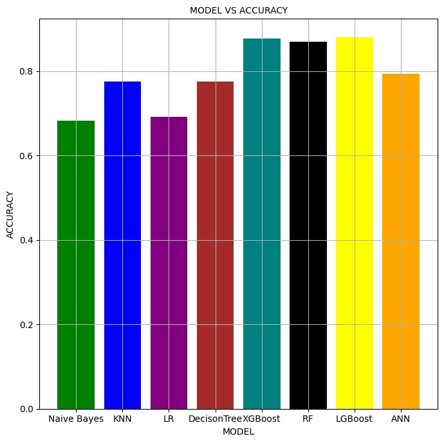

# :mag: HR Analytics – Likeliness of a Data Scientist to switch job

# :memo: Description
This project aims at classifying the profiles of the candidates to determine their likeliness to switch jobs based on a candidates demographics and job profile. 

We apply the following algorithms to make this classification:
1. Naïve Bayes
2. K-Nearest Neighbour 
3. Logistic Regression
4. Decision Tree
5. Random Forest 
6. XG Boost
7. Light GBM
8. Artificial Neural Network

The [Jupyter Notebook](<CS 513 Group 2.ipynb>) has the full implementation code.

# :package: Dataset
The dataset for this project is taken from [Kaggle](https://www.kaggle.com/datasets/arashnic/hr-analytics-job-change-of-data-scientists/data). Some details about the dataset:
- 19K rows
- 14 features
- Binary targets (whether or not the candidate is willing to switch jobs)

Download the code from Kaggle and save the `aug_test.csv` and `aug_train.csv` files in the `data` folder.

  
<b>More information about the dataset</b>

    - enrollee_id: Unique ID for candidate
    - city: City code
    - city_development_index : Development index of the city (scaled)
    - gender: Gender of candidate
    - relevent_experience: Relevant experience of candidate
    - enrolled_university: Type of University course enrolled if any
    - education_level: Education level of candidate
    - major_discipline: Education major discipline of candidate
    - experience: Candidate total experience in years
    - company_size: No of employees in current employer's company
    - company_type : Type of current employer
    - lastnewjob: Difference in years between previous job and current job
    - training_hours: training hours completed
    - target: 
      - 0 – Not looking for job change
      - 1 – Looking for a job change (binary classification)

# :bar_chart: Results

Comparing the accuracy of the models we implemented:

# :warning: Requirements

- bifurcate code
- tell user to download data
- 